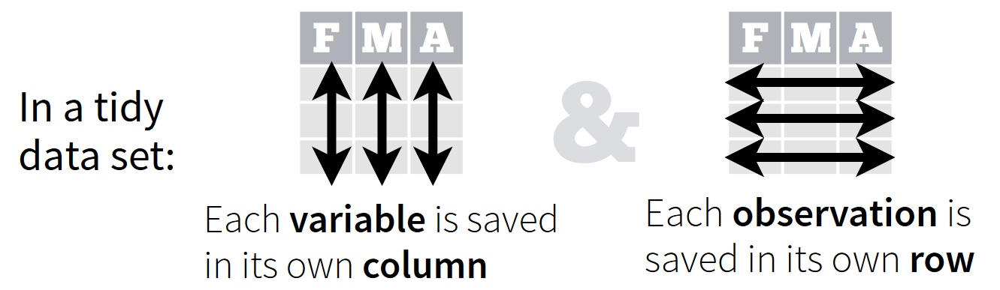

```{r setup, include=FALSE}
knitr::opts_chunk$set(echo = TRUE)
```

## 1. Overview

Now that we have done all this work to set-up, calibrate, and validate SWAT, we can explore our results. However, before we jump into data analysis, there are a few things we need to do. First, we need to make sure  we understand the purpose of each of the 10 SWAT output files. Next, we might want to reformat these raw SWAT output files so they are easier to work with (i.e., tidy them up). Last, we have to save these reformatted outputs so we can use them for data analysis. This act of taking raw SWAT outputs, reformatting them, and saving this reformatted version is called *post-processing*.

The overall goal of this workshop session is to provide you with some tools to make your post-processing of SWAT outputs easy and reproducible.

By the end of this workshop session you will be able to:

1. *explain* different SWAT output files and their contents

2. *identify* key features of RStudio

3. *describe* key tidy data principles


## 2. SWAT Output Files

Activity 1:

1. Navigate to the `TxtInOut` directory on your computer (C drive > SWAT > SWATRuns > <your SWAT project name > Scenarios > Default > TxtInOut) and, using the search bar, type in 'output'. Pull out a piece of paper and jot down the names of the different plain text files you see that start with 'output' (hint: they should only differ by their file extensions).

2. *(5 min on your own)* Now that you have a list of the output.* files, head over to chapter 32 of the SWAT help manual here: http://swat.tamu.edu/media/69395/ch32_output.pdf. Read through the SWAT documentation and jot down a short summary of the information contained in each file you listed in #1.

3. *(5 min with a partner)* Share what you found with a partner.

4. *(5 min class discussion)* Share what you and your partner found with the class.


## 3. A Whirlwind Tour of RStudio

RStudio is an integrated development environment (IDE) for `R` that you can install only after you've installed `R`. Basically, RStudio makes coding in `R` easier. There are some aspects of RStudio we'll explore now.

* Editor window (view and run scripts)
* Console window (view outputs/code errors)
* Environment window (see variables in memory and view history)
* File directory/Plot/Help window (see file path, see plots, ask for help)


## 4. What is tidy data?

According to the [RStudio Data Wrangling Cheatsheet (click for link)...](https://www.rstudio.com/wp-content/uploads/2015/02/data-wrangling-cheatsheet.pdf)




What should tidy SWAT outputs look like? Each row would be a day/month/year and each column would be a different variable of interest (e.g., streamflow).

There are other key features that make data easier for others to use:

* Clear column headers
* Clear units are given
* Clear representation of missing data
* Metadata is included
* No spaces in column names (R only likes .'s, _'s, or -'s, e.g. temp_deg_c for temperature in degrees C)
* Anything else?


Activity 2:

1. *(5 min on your own)* Open up the `output.rch` file in your favorite text editor. How is it organized? Is it tidy? Why or why not? Write down some things you notice on a piece of paper.

2. *(5 min with a partner)* Share what you found with a partner.

3. *(5 min class discussion)* Share what you and your partner found with the class.


## 5. Importing Data into R/RStudio

Let's try to import some of our SWAT data into R/RStudio.

First we use `library()` to load the `tidyverse` package that has functions to help us import our data. If you're interested in learning more about the `tidyverse` package, which includes a whole happy family of other awesome packages, you can read more here: https://www.tidyverse.org/.

```{r loading packages, results=FALSE, message = FALSE, warning=FALSE}

# install and load some packages with functions that we'll need
install.packages("tidyverse") # only do this once!
library(tidyverse) # do this each time you open a new script and need it

```

Next we check where RStudio is currently looking for our data.

```{r looking at current path}
# check what working directory you are in
getwd()

```

You will need to use the code below to set your working directory to point to the directory where the `output.rch` file is stored.

```{r set path, eval = FALSE, echo = TRUE}

setwd('/Users/ssaia/Documents/GitHub/ecohydro-modeling-workshop-mar2018/data/swat_output_data')
# copy/paste the path to the data directory inside the function setwd()
# windows users may have to change /'s to \\'s when copy/pasting

```

Now let's import the `output.rch` file.

```{r import raw data, results = FALSE, echo = TRUE, message = FALSE}

# You will need to change what's between the 's here. It should be output.rch.
raw_rch_data = read_table('/Users/ssaia/Documents/GitHub/ecohydro-modeling-workshop-mar2018/data/swat_output_data/output.rch')

```

Now let's look at it. You can click on it in the Environment window, or type `View(raw_rch_dat)` into the Console window You can also use `head()` like this to view the first 20 lines...

```{r look at data}

head(raw_rch_data, n = 20)

```

Hmm...it's coming in as one big column. Why do you think this is happening here? (Hint: Think back to our tidy data critique of the file.) We might have to do some reformatting...


(Image credit: http://www.doctorwhotv.co.uk/)


